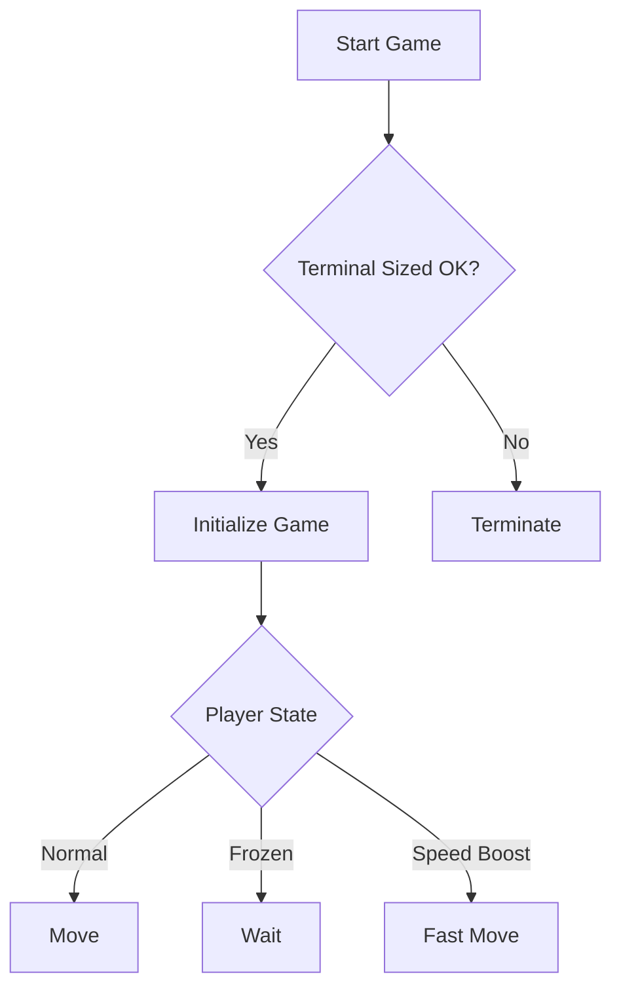

## C# Methods Challenge Project

### Project Overview
An interactive console game implementation focusing on method creation and parameter handling in C#. This project extends the Microsoft Learn starter code with additional functionality and game mechanics.

> [!IMPORTANT]
> This project is part of a Freecodecamp free course on C# fundamentals
- It was done by me with little AI assistance throughout the process
- Super simple console game to grasp the flow of C#
- Educational purposes only

### Active Development Notice
> The program is currently under active development, with ongoing bug fixes. Contributions and suggestions are welcome in the repository's Issues section, and all viable solutions will be reviewed.

### Architecture

#### Pre-implemented Methods
```csharp
public class Game
{
    void InitializeGame();     // Sets up initial game state
    bool TerminalResized();    // Checks console window dimensions
    void ShowFood();           // Displays food elements
    void ChangePlayer();       // Updates player appearance
    void FreezePlayer();       // Implements player freeze mechanic
    void Move();              // Handles player movement
}
```

##### Key Note
The `Move()` method accepts two optional parameters:
- `check`: Controls game termination
- `speed`: Modifies movement speed

### Implementation Details

#### Task One: Game Control Mechanics
##### Objectives
- Implement terminal resize detection
- Add non-directional key game termination

##### Implementation
```csharp
void AnnounceTerminating()
{
    // Handles game termination conditions
    // Uses Random class for termination parameter
}
```

##### Features
- Terminal resize detection
- Random-based game termination
- Non-directional key handling

#### Task Two: Game State Management
##### Objectives
- Food system implementation
- Player appearance updates

##### Implementation
```csharp
bool JustAteFood()
{
    // Manages food consumption
    // Triggers player appearance changes
}
```

##### Features
- Dynamic food updates
- Player appearance management
- State tracking system

#### Task Three: Advanced Player Mechanics
##### Objectives
- Implement temporary player freezing
- Add speed boost mechanics

##### Implementation
```csharp
public class PlayerMechanics
{
    bool CheckMovementSpeed()  // Handles speed boost for (^-^)
    bool CheckFreezeCondition() // Manages freeze state for (X_X)
}
```

##### Mechanics
| Appearance | Effect | Implementation |
|------------|--------|----------------|
| `(X_X)`    | Temporary freeze | `CheckFreezeCondition()` |
| `(^-^)`    | Speed boost (×3) | `CheckMovementSpeed()` |

### Game Features
- Dynamic player states
- Speed modification system
- Temporary freeze mechanics
- Food collection system
- Terminal size adaptation

### Tips for Success
1. Practice consistently
2. Experiment with the code
3. Join the discussion for bug fixes
4. Test different game scenarios

### Workflow


### Licence
This project is licensed under the MIT Licence. See the [LICENCE](./LICENSE) file for further details.
